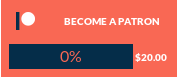

# October patreon

## Setup 

### Logging in to Patreon
Once the plugin is installed a new tab will appear in the backend menu. This tab contains the instructions on how to connect your patreon account. Here is the general gist of those instructions:

- Register a Patreon application [here](https://www.patreon.com/platform/documentation/clients)
- Go to the settings page of your October website and set your client_secret and client_id. The settings page also includes options to set the refresh time (how often the plugin will refresh the data from patreon, very important to set that) and the link to your patreon. 
- Set the "redirect_url" of your patreon application, the plugin will provide the link in the patreon tab, set it in your patreon application settings.
- Finally, click the connect application button to connect your patreon to your website.

### Adding the goal component to a page
### Regular page (not a partial)
- Navigate to the CMS section of the october backend
- Click the page you want to add the component to
- Click components in the left sidebar
- Click the patreon drop down
- Click "Goal Component"
- add:  wherver you want the component to show up. 

### Partial (usually your header, footer, etc.)
- The steps are the same as adding it to a regular page, except you need to add the  tag and  tag to the top of the page.

### Adding to a partial:

If you add this component to a partial, be sure to include the `` and `` tags.
