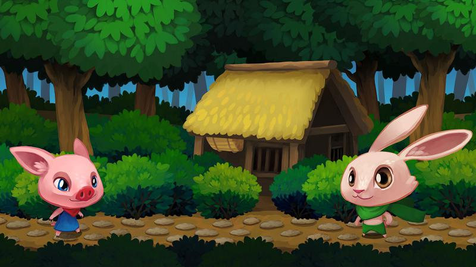
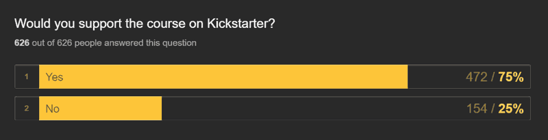

# Godot Course on Kickstarter Next Monday!

<!-- BANNER IMG -->

Hey there, I'm GDquest, a content creator. I make [game creation tutorials](http://gdquest.com/tutorial/) with open source technologies. The developers and I decided to collaborate to fund and produce the first game creation course for the upcoming Godot 3. A professional training costs a lot to make, and because of that it has to be crowdfunded. We asked you, the community, if you were interested, and the response was extremely positive!

So, it's happening. The project will be up **on Kickstarter next Monday, on May 22, at 12PM CEST!**

## The course's content

Once we reach the initial funding goal, you'll get **at least 40 exclusive tutorials, 10 assignments and commented code sources** in the premium version. I sure could lower the quality and make a lengthier series, but I'd rather help you learn more in less time. If you watch Gdquest on Youtube, you'll know I'm all about quality over quantity. Also, take it as minimum! I don't want to stop there, and i'll work hard to provide as much value as I can.

<figure>

    <figcaption>The training will reuse the work done for the Krita course, but in a top-down game</figcaption>
</figure>

The series will revolve around a 2d Zelda-like, as the mechanics we'll look at are directly applicable to all kinds of games. But the goal is to teach you much more than that! It will give you a better understanding of the engine, of the game creation workflow, and how to write solid code! Fellow developers and teachers offered to give advice and share insights to elevate the content even more.

Oh, and as you might expect, the higher the funding, the more content you will get, regardless of your pledge. **Every single cent will be spent on the course**.

## 30 days tutorial challenge

There is already a ton of videos on the channels for you to watch now. But there's only a short series dedicated to Godot. During the Kickstarter campaign, i'll release **one free tutorial every single day**, mostly about the engine! It's going to be tough, but that's my way of giving back to the community.

## It's all based on your feedback

I put out a form to ask you what you wanted to learn exactly, and you've been [more than 600 to reply](https://gdquest.typeform.com/report/ul3bc1/prym)!

Your requests shaped the project already. There are hundreds of completely different suggestions, some as challenging as “show how to make a 3d MMORPG”, so I can't cover them all. But I took note of everything that's most useful, and exciting. You'll see some of them in the free tutorials.

## It starts next week

Crowdfunding, by essence, involves the community. It Cannot happen without you.

The Kickstarter starts on Monday 22 at 12 PM CEST.

Subscribe on Gumroad below and get notified via email when the Kickstarter is up!

<form action="https://gumroad.com/follow_from_embed_form" class="form gumroad-follow-form-embed" method="post"><input name="seller_id" type="hidden" value="6873367754130"> <input name="email" placeholder="Your email address" type="email"> <button data-custom-highlight-color="" type="submit">Sign up</button></form>

If you haven't already:

-   [Subscribe to the Youtube channel](http://youtube.com/c/gdquest)
-   [Follow me on Twitter](https://twitter.com/NathanGDquest)

And feel free to message me on the [Godot Discord server](https://discordapp.com/invite/zH7NUgz) anytime (@gdquest#4637)

_Thank you kindly for your time!_
